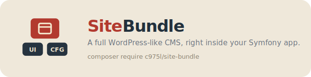

# SiteBundle

Symfony bundle that provides a complete foundation for building websites — layout, pages, SEO, admin, sitemap, legal templates, and more.

[](https://github.com/975L/SiteBundle/blob/master/LICENSE)
[](https://packagist.org/packages/c975l/site-bundle)
[](https://packagist.org/packages/c975l/site-bundle)

## Why SiteBundle



Add SiteBundle on top of the shared [UiBundle](https://github.com/975L/UiBundle) + [ConfigBundle](https://github.com/975L/ConfigBundle) foundation and get a complete website — pages, menus, SEO, EasyAdmin back office. Need a book catalog, an online shop, a photo gallery? Add [BookBundle](https://github.com/975L/BookBundle), [ShopBundle](https://github.com/975L/ShopBundle), [GalleryBundle](https://github.com/975L/GalleryBundle): they rest on the same foundation, alongside SiteBundle, never on top of it.

---

## Features

- **Base layout** with SEO-optimized meta tags (OpenGraph, robots, canonical, favicon, Apple touch icon)
- **Page display** from Twig templates (file-based) or from the database via the `Page` entity
- **Page redirects** and 410 Gone handling
- **Admin CRUD** for database pages via EasyAdmin
- **Admin CRUD** for users via EasyAdmin, with role management
- **Admin CRUD** for the site's navbar/footer menus and the email header/footer via EasyAdmin
- **Admin CRUD** for the site's graphics (favicon, Apple touch icon, logo, default Open Graph image) via EasyAdmin
- **Sitemap generation** from both filesystem templates and database pages, with a "Regenerate sitemap" dashboard shortcut
- **Error page templates** for 401, 403, 404, 410, and 500
- **Legal model templates** for France (French): cookies, copyright, legal notice, privacy policy, terms of sales, terms of use
- **Matomo analytics** integration
- **CookieConsent** integration
- **Alternate language** hreflang meta tags
- **Open Graph** image support
- **Email templates** with CSS inlining
- **Asset serving** controller (inline display, access-protected)
- **File download** controller (forced download, access-protected)
- **Twig extensions**: `route_exists`, `template_exists`, `asset_exists`, `nl2br`
- **File lists**: `extensions.txt` and `bots.txt`
- **Admin help procedures** contributed to the dashboard AI assistant, describing how to create pages, redirects, menus, etc.

---

## Requirements

- PHP >= 8.1
- [c975L/ConfigBundle](https://github.com/975L/ConfigBundle)
- [c975L/UiBundle](https://github.com/975L/UiBundle)
- Doctrine ORM
- EasyAdmin
- symfony/ux-twig-component
- twig/cssinliner-extra

Optional: [nelmio/security-bundle](https://github.com/nelmio/NelmioSecurityBundle), if installed, has its CSP nonce generator decorated by `SessionNonceGenerator` — keeps the nonce stable for the whole session instead of per-request, so Turbo Drive/Frames/Streams re-executing `<script>` tags from a fetched page doesn't get them blocked by a mismatched nonce. A no-op if the bundle isn't installed.

---

## Installation

### Download

```bash
composer require c975l/site-bundle
```

### Load configuration values

This bundle uses [c975L/ConfigBundle](https://github.com/975L/ConfigBundle) to manage its settings. Load the default configuration keys into the database:

```bash
php bin/console c975l:config:load-all
```

Then open the ConfigBundle dashboard to set values for the keys

### Enable routes

Add the bundle routes to `config/routes.yaml`:

```yaml
c975_l_site:
    resource: "@c975LSiteBundle/src/Controller/"
    type: attribute
    prefix: /
    # For multilingual websites:
    # prefix: /{_locale}
    # defaults:
    #     _locale: '%locale%'
    # requirements:
    #     _locale: en|fr|es
```

### Install assets

```bash
php bin/console assets:install --symlink
```

### Register Stimulus controllers

This bundle ships Stimulus controllers (basic, matomo, cookieConsent). They are exposed via AssetMapper under the `@c975l/site-bundle` namespace.

Its `importmap.php` entry is added automatically the first time you `composer update` after installing SiteBundle — see [Contributing importmap entries from other bundles](https://github.com/975L/ConfigBundle#contributing-importmap-entries-from-other-bundles) in ConfigBundle's README, nothing to add by hand.

**Add two lines to `assets/bootstrap.js`** (or `assets/stimulus_bootstrap.js`):

```js
import { startStimulusApp } from '@symfony/stimulus-bundle';
import { register as registerc975lSite } from '@c975l/site-bundle/controllers.js';

const app = startStimulusApp();
registerc975lSite(app);
```

After that, all controllers are loaded with hashed filenames (cache busting). Adding or removing controllers in a future bundle update requires no change in your app.

---

## Usage

### Creating your layout

Create `templates/layout.html.twig` in your project and extend the bundle's layout:

```twig

```

### Page-specific variables

Declare these variables in each page template to populate meta tags and the page title:

```twig


```

### Template blocks

The layout exposes the following Twig blocks for you to override or extend:

| Block | Description |
| --- | --- |
| `head` | Entire `<head>` element |
| `meta` | Meta tags (charset, viewport, robots, og:*, etc.) |
| `stylesheets` | CSS links |
| `preconnect` | `<link rel="preconnect">` hints |
| `body` | Entire `<body>` element |
| `header` | Site header |
| `navigation` | Main navigation |
| `main` | Main content wrapper |
| `title` | Page `<h1>` title |
| `flashes` | Flash messages |
| `container` | Container div wrapping `content` |
| `content` | Page-specific content |
| `share` | Sharing widgets |
| `navigationBottom` | Bottom navigation |
| `footer` | Site footer |
| `javascripts` | JavaScript includes |

**Override a block:**

```twig

    {{ parent() }}
    {# your additional content #}

```

**Disable a block:**

```twig

```

### Display mode

Use the `display` variable to conditionally include templates (defaults to `html`):

```twig

    

    

```

---

## Pages

### File-based pages

Place Twig templates in `templates/pages/`. They are served at `/pages/{slug}` via the `page_display` route.

To **hint the sitemap generator**, add metadata in a Twig comment at the top of the file:

```twig
{# changeFrequency="monthly" priority="8" #}
```

### Redirects and deleted pages

| Location | Effect |
| --- | --- |
| `templates/pages/redirected/{slug}.html.twig` | Redirects to the slug written inside the file |
| `templates/pages/deleted/{slug}.html.twig` | Throws a 410 Gone exception |

Database-managed redirects (`Redirect` entity, `fromPath`/`toUrl`/`permanent`) go through `RedirectExportProvider`/`RedirectImportProvider`, plugging them into ConfigBundle's **Export sync (everything)** dashboard shortcut and **Import content** screen — matched by `fromPath`, `Redirect`'s own unique constraint.

### Database pages

Use the `Page` entity to manage pages through the database. Each page supports:

- Title, slug (unique), summarySocialNetwork
- Published status and display position
- Sitemap fields: change frequency and priority (0–10)
- Blocks (content blocks from [c975L/UiBundle](https://github.com/975L/UiBundle))
- Creation / modification timestamps and author reference

Database pages are rendered with the bundle's `@c975LSite/pages/page.html.twig` template, which displays the page title, summarySocialNetwork, and its associated blocks.

`PageController::home()`/`display()` don't set an HTTP `Cache-Control: max-age` on the response (dropped in favor of UiBundle's per-block server-side cache, see its README's "Block render cache" section: infinite TTL, invalidated on save, shared by every visitor - rather than a per-browser cache with no way to invalidate it early after an edit).

### Blocks defined by this bundle

On top of the generic block system provided by [c975L/UiBundle](https://github.com/975L/UiBundle), SiteBundle registers the following blocks (see `config/services.yaml`):

| Kind | Category | Description |
| --- | --- | --- |
| `legal_model` | `label.category_legal` | Renders one of the built-in legal page models (cookies policy, copyright, legal notice, privacy policy, terms of sales, terms of use), localized under `templates/models/{country}/{model}.html.twig`. Optionally displays a "latest update" date. |
| `twig_content` | `label.category_twig` | Includes an existing Twig template by its path (`templatePath`, e.g. `pages/details/project.html.twig`) - a general-purpose "drop this template in here" block, not limited to the [collection item detail pages](#item-detail-pages) use case that motivated it. |
| `articles_slider` | `label.category_navigation` | Picks another database page and renders its `article` blocks (that have at least one media) as a clickable slider, using the `<twig:c975LUi:Slider:Slider>` component from UiBundle. |
| `menu_link` | `label.category_navigation` | A link to a published `Page` or a bundle-contributed route (see [Linking to a bundle's own route](#linking-to-a-bundles-own-route)); this is how `Menu` rows (navbar/footer/email-header/email-footer, see [Menus](#menus)) build their navigation, sortable alongside any other block. Restricted to the `menu` context (UiBundle's `contexts` tag attribute, requires `c975l/ui-bundle` with context-aware `BlockRegistry::groupedByCategory()`), so it isn't offered when picking blocks for a `Page`. Not cacheable: its "active" state depends on the current request path. |

Each block is registered as a `ui.block`-tagged service, with a dedicated form (`c975L\SiteBundle\Form\Block\*Type`) and template (`templates/blocks/*.html.twig`). The `articles_slider` block relies on the `site_page(id)` Twig function (`PageExtension`) to eager-load the target page along with its blocks and medias. Like any `ui.block`, `menu_link` is `pickable: true` and has no context restriction, so it also shows up in a `Page`'s own block picker - harmless (it just renders a link) but not the intended use.

### Admin management

Pages are managed in the EasyAdmin dashboard via `PageCrudController`. The menu entry is registered automatically through `MenuProvider`. Access is controlled by the `site-role-editor` key in ConfigBundle.

Selected pages can also be exported as a zip (title/slug/blocks, any Block's Media files bundled in) via the index's "Export selection" batch action, gated by `site-role-admin` — meant to be re-uploaded on another site/environment through ConfigBundle's **Import content** dashboard screen (see `PageImportProvider`, and ConfigBundle's README, "Contributing import providers from other bundles"). Ids never need to match between the two sites: pages/media are matched by slug on import. `PageExportProvider` (the same serialization, every non-deleted page) also plugs Pages into ConfigBundle's **Export sync (everything)** dashboard shortcut.

### Page templates

`config/templates/*.json` ships reusable, ordered arrangements of blocks (kind + example data) an admin can apply to a `Page` — a starting point to edit from, not a live/synced layout. `default` is a generic, content-agnostic one meant as a sane starting point regardless of the site's theme; `agency-home`/`portfolio-showcase` are fuller demo arrangements. Listed via `SiteTemplateProvider` (implements `TemplateProviderInterface`) and aggregated with any other bundle's — or the consuming app's own — templates by `TemplateRegistry`: an app that wants its own templates implements `TemplateProviderInterface` in its own service (auto-tagged), no change needed here.

From the admin, `PageCrudController`'s per-template "Apply template" action never edits the page in place: it creates an unpublished draft copy pre-filled with the template's blocks, marked as replacing the source page. The `c975l:site:templates:apply` command (see [Commands](#commands)) still applies in place, deliberately, for scripted use across several pages/sites at once. Both share the same `TemplateApplier`.

Any non-deleted page's edit screen carries its own "Publish as replacement" action group, listing every other page as a target — picking one swaps the current page in for it: the target's slug is archived and it's moved to the trash (recoverable via the usual "Restore" action, which reclaims the archived slug if still free, otherwise keeps the technical one). This works for any page, not just a template-created draft (above) — that draft's "replaces" origin is now only a fallback default, no longer a requirement.

A page template is entirely independent from the site's [theme](#themes) (colors/fonts/shape): neither ever references the other, and applying one never touches the other.

---

## Menus

The site-wide navbar, footer, email header and email footer are managed entirely from the database — no app-side template override needed. Each is a `Menu` (`location`: `navbar`, `footer`, `email-header` or `email-footer`, one row per location, same singleton pattern as the site-wide graphics managed via `SiteGraphicCrudController`).

Every location owns a single ordered `blocks` collection (same generic UiBundle `Block` system as `Page`, see [Blocks defined by this bundle](#blocks-defined-by-this-bundle)) — menu links and any other registered block kind (e.g. SocialBundle's `social_links_display`) are freely sortable together, no separate "items" collection to keep in sync. A menu link is itself a block, of kind `menu_link` (form: `MenuLinkType`), targeting either:

- an existing `Page` (linked by its id, so renaming the page's slug never breaks the link) — unpublished pages stay pickable too, flagged "(draft)" in the picker, and simply resolve to no URL until published, or
- a route contributed by another bundle (see [Linking to a bundle's own route](#linking-to-a-bundles-own-route) below)

`menu_link` resolves to a relative URL (`UrlGeneratorInterface::generate()`), fine for `navbar`/`footer` but not usable as-is inside an email — `email-header`/`email-footer` are meant for content that doesn't need one (e.g. social icons, legal blurbs), not for reusing the site's own links.

Managed via `MenuCrudController` (drag-and-drop reordering, same mechanism as [Blocks](#blocks-defined-by-this-bundle)). Access is controlled by the `site-role-editor` key in ConfigBundle.

`navbar` and `footer` are rendered by built-in components already wired into the bundle's layout (`navigation`/`footer` blocks) — nothing to add in your app:

```twig
<twig:c975LSite:General:Navbar/>
<twig:c975LSite:General:Footer copyright="{{ copyright }}"/>
```

`email-header` and `email-footer` are rendered the same way inside `@c975LSite/emails/header.html.twig` and `@c975LSite/emails/footer.html.twig` respectively (see [Email templates](#email-templates)), independently from the site's own `navbar`/`footer` — each location is edited separately, so the client can keep different content for emails than for the site.

A block disappears from the rendered menu automatically (no dangling link) if its `menu_link` targets a page that's later unpublished/deleted, or a route whose contributing bundle is removed.

`MenuExportProvider`/`MenuImportProvider` plug all four locations into ConfigBundle's **Export sync (everything)** dashboard shortcut and **Import content** screen — matched by `location` on import, same "whole Block collection replaced" approach as `PageImportProvider`.

### Linking to a section of a page (anchors)

A `menu_link`'s target can also point at a specific **section** of a page, not just the page itself - useful for a one-page nav (`#services`, `#contact`...). Any UiBundle "Page sections" block kind (`hero`, `feature_bar`, `section_cards`, `expertise_banner`, `process_steps`, `portfolio_grid`, `cta_band`, `collection` - see UiBundle's README, "Anchors (in-page navigation)") can carry an anchor; once at least one block on a page has one, `MenuLinkType`'s target select lists it right under that page's own entry (e.g. `Home → Services`), with no extra step - it's still the same flat, filterable list, just with more rows.

Under the hood, the target is stored as `page:<id>#<anchor>-<blockId>` and resolved by `MenuExtension::getMenuLinkUrl()` into `/home#services-42` - the trailing `#fragment` is only added when present, so a plain `page:<id>` target keeps working exactly as before.

### Copyright

The "© firstYear - currentYear[ : siteName]" copyright notice (built from the `site-first-online-date`/`site-name` ConfigBundle keys) is computed by the `site_copyright(bool $withSiteName = true)` Twig function, shared by `layout.html.twig` and `emails/fullLayout.html.twig`.

A `menu_link` targeting the site's own "Copyright" page (the one `DefaultPagesImporter` seeds under the `france/copyright` model — `copyright`/`copyright-notice`/`aviso-de-copyright` depending on locale) automatically shows this live-computed text as its label instead of the page's own title, gated by the `site-menu-link-copyright-auto` ConfigBundle key (`bool`, default `true`) — lets a footer's "Copyright" page link double as the copyright notice instead of showing both side by side. `menu_link` also has an optional `label` field (`MenuLinkType`) that always overrides the auto-derived label (page/section title or computed copyright) when filled in.

A `menu_link` also has an optional `primary` checkbox (`MenuLinkType`) that renders it as a filled, primary-color button (`.menu-item--primary`, see `sass/_menu.scss`) instead of a plain text link — meant for a single stand-out item (e.g. a "Contact" link in the navbar), not for every item in a `Menu`.

### Navbar: logo, site name, tagline

`Navbar` reads `site_media('logo')`, `config('site-name')` and `config('site-tagline')` — nothing to pass in. `site-name` stays mandatory (used across meta tags, page titles, etc.), but showing it in the navbar specifically is optional via the `site-navbar-show-name` ConfigBundle key (`bool`, default `true`).

The navbar's CSS `position` is set via the `site-navbar-position` ConfigBundle key (`text`, one of `relative` (default), `sticky`, `fixed`, `static`, `absolute` — any other value is ignored), inlined as the `--navbar-position` custom property. `fixed` additionally adds `.menu-fixed` on the `<nav>` and a `navbar-fixed` class on `<body>` to compensate the space it frees from the normal flow; other values are left to the theme's own `--navbar-position` fallback.

`site-tagline` is authored as rich text in the backoffice (Trix wraps the value in its own `<div>`), so it's rendered with `|raw` — style `.menu-site-tagline` in your own SCSS if you need to adjust it.

### Linking to a bundle's own route

A `menu_link` block isn't limited to database pages. Any bundle can expose one of its own front-end routes as a selectable target by implementing ConfigBundle's `LinkableRouteProviderInterface` — see [ConfigBundle's README](https://github.com/975L/ConfigBundle#contributing-linkable-routes-for-sitebundle-menus) for how to write the provider. The same approach will apply to ShopBundle and BookBundle.

Since login isn't a SiteBundle route but scaffolded straight into `App\Controller` (see [Users](#users) below), the scaffold also ships `App\Management\LinkableRouteProvider`, so `app_login` shows up in the `menu_link` picker out of the box — re-run the scaffold install (or copy the file by hand) on sites that predate it. Register and reset-password aren't routes to link to anymore: they're the ordinary database `Page`s seeded by `DefaultPagesImporter` (see [Import default pages](#import-default-pages)), picked from the `menu_link` picker like any other page. `app_verify_email` and `app_reset_password` are deliberately left out of `LinkableRouteProvider`: they only make sense reached through a signed link, not as a standalone menu target.

### Social links

Social icons in the footer (site or email) are no longer a dedicated component/config toggle — they're a regular block, dropped into the footer's own `blocks` collection like any other. See [c975L/SocialBundle](https://github.com/975L/SocialBundle)'s README for the `social_links`/`social_links_display` block kinds it registers.

---

## Users

`App\Entity\User` is managed in the EasyAdmin dashboard via `UserCrudController`. The menu entry is registered automatically through `MenuProvider`. Access is controlled by the `site-role-admin` key in ConfigBundle, same as pages.

The controller relies on EasyAdmin's auto-discovery of the app's own `User` fields (which vary per app), except for:

- The hashed password field, excluded so it's never displayed or overwritten from the backoffice
- The `roles` field, added explicitly as a multiple-choice field, since JSON columns are never auto-discovered by EasyAdmin
- The `creation` / `modification` fields, made readonly since they're set automatically
- The `isVerified` field, made readonly since it must only be set by `EmailVerifier` upon email confirmation, never edited by hand from the backoffice

`ROLE_USER` is always excluded from the choices (every user already has it by default, see `User::getRoles()`). The other selectable roles come from the `user-roles-available` ConfigBundle key (`json` kind, e.g. `["ROLE_ADMIN","ROLE_EDITOR"]`) — add roles for your app there, no code change needed.

The detail page is disabled (not useful on top of the index and edit pages).

### ROLE_SUPER_ADMIN and restricted configs

Requires `c975l/config-bundle` >= v5.4.

Some configs are shared server-level secrets rather than per-site application settings — for
example `site-backup-db-user`/`site-backup-db-password`, used by `c975l:site:backup` (see
[Commands](#commands)): a single privileged MySQL user reused to back up the database, not
something a client's own site admin should ever be able to read or overwrite. ConfigBundle flags
these with `"restricted": true` in
`configs.json`; any config so flagged is hidden entirely (index, edit, and export) from
every user except one holding `ROLE_SUPER_ADMIN`, regardless of `site-role-admin`.

`c975l:site:create` grants `ROLE_SUPER_ADMIN` (together with `ROLE_ADMIN`) to the bootstrap user
automatically, since whoever runs it owns the site. When you (the producer) deploy a client's site,
run `site:create` yourself to become its super-admin, then create the client's own users with plain
`ROLE_ADMIN` via the User CRUD — they get full access to pages, menus, general configs, etc., but
the `backup` config group stays out of their reach. A standalone install where you're the only user
is never affected, since your own bootstrap account already holds both roles.

To make your own bundle's configs restricted the same way, just add `"restricted": true` next to
`"sensitive"` in its `configs.json` entry. `site-role-admin` and `user-roles-available` are
restricted too: they gate the whole admin and decide which roles exist, so a plain `ROLE_ADMIN`
must never be able to touch them.

That last point matters for the role picker itself: `UserCrudController` strips `ROLE_SUPER_ADMIN`
from the choices offered on the `roles` field unless the acting user already holds it — server-side,
not just visually, so Symfony's `ChoiceType` rejects a crafted submission trying to sneak it in
anyway. Without this, listing `ROLE_SUPER_ADMIN` in `user-roles-available` would let any
`ROLE_ADMIN` grant it to themselves through the User CRUD and bypass every restricted config in one
step.

### Disabling registration

Registration/reset-password-request are plain `c975L\UiBundle\Entity\Form` rows ("register"/"reset_password_request"), processed by UiBundle's generic `c975L\UiBundle\Controller\FormController` exactly like "contact" - no dedicated `RegistrationController`/`ResetPasswordController` action builds or displays them anymore. To turn registration off without a deployment, uncheck the "register" Form's `enabled` field from the admin's Forms screen (or toggle it from the dashboard shortcut) - `FormController` then shows a generic "not available" notice instead of the form, on both the standalone `/form/register` route and the "form" Block wherever it's embedded.

### Registration anti-spam protections

Registration/reset-password-request reject bots at several layers, so a public form doesn't turn into a way to farm confirmation emails towards throwaway domains. Their fields ("email"/"plainPassword"/"cgu" for registration, "email" for the reset request) are the `register`/`reset_password_request` rows of `c975L\UiBundle\Entity\Form` (`site_form`/`site_form_field`) - the same mechanism as "contact", editable (label/placeholder/order) from the admin's Forms screen, with `type` and deletion locked on these core fields - built into a plain Symfony form by `c975L\UiBundle\Form\FormSubmissionType`, which is what actually adds the protections below. Processing itself (password hashing, verification email, reset token) is scaffold's `App\Service\RegisterFormAction`/`ResetPasswordRequestFormAction` (a `c975L\UiBundle\Contract\FormActionInterface` each, auto-registered - see UiBundle's own README for the mechanism), not a controller.

- **`Assert\Email` + `c975L\UiBundle\Validator\Constraints\DnsEmail`** on every email-typed field — format check, then a live MX/A DNS lookup (via `egulias/email-validator`) rejecting domains that can't receive mail at all (e.g. `something@dominatingkeywords.com`). Applies to any generic Form's email field (contact/register/reset-password-request alike), plus `User::$email` itself on every entity validation (including the User CRUD in the backoffice, which still carries its own `#[DnsEmail]`).
- **Honeypot + minimum submit delay** — an invisible rotating-name field (hidden inline, no CSS dependency), and a minimum delay between displaying the form and submitting it, tracked in session. Either one failing silently redirects back (same "form_submitted" flash as a real submission) without creating an account or sending any email, giving no signal back to the bot. The delay is the shared `site-form-delay` ConfigBundle key (seconds, default `3`) - one setting for every public form (contact, register, reset-password-request) instead of one per bundle.
- **GDPR consent checkbox** - shown on both forms (unmapped `gdpr` field, using the bundle's own `text.gdpr` translation) when the shared `site-form-gdpr` ConfigBundle key (bool, default `true`) is enabled. The registration form also carries a `cgu` field (terms-of-use acceptance), enforced the same way.
- **Rate limiting by IP** — shared with every other generic Form (`limiter.ui_form`, optional), not a dedicated `registration`/`reset_password` limiter anymore:

```yaml
# config/packages/rate_limiter.yaml
framework:
    rate_limiter:
        ui_form:
            policy: sliding_window
            limit: 5
            interval: '10 minutes'
```

Without this config, rate limiting is simply skipped (fails open) rather than erroring - see `c975L\UiBundle\Service\RateLimiterGuard`.
- **Duplicate email** - `RegisterFormAction` silently succeeds (same flash, no account created, no email sent) when the submitted email already has an account, same non-revealing stance `ResetPasswordRequestFormAction` already has for "no such account".

### Login throttling

`c975l:site:create` also inserts `login_throttling: { max_attempts: 5 }` onto the `main` firewall in `config/packages/security.yaml` (same step as `user_checker` above), using Symfony's built-in rate limiter for `/login` - no custom code involved. If your site predates this or uses a differently-named firewall, add it yourself:

```yaml
security:
    firewalls:
        main:
            login_throttling:
                max_attempts: 5
```

### Account activation (`isEnabled`)

`App\Entity\User::isEnabled` gates login independently from `isVerified`. `c975L\SiteBundle\Service\EmailVerifier::handleEmailConfirmation` (a bundle service, called from the scaffolded `RegistrationController`) sets both `isVerified` and `isEnabled` to `true` once the user confirms their email — `c975l:site:create` does the same for the bootstrap admin account, since there's no email to confirm. Registration itself (hashing the password, persisting the user, sending the confirmation email) goes through the bundle's `UserRegistrar` service, called from the scaffolded `App\Service\RegisterFormAction` (see [Registration anti-spam protections](#registration-anti-spam-protections)); `PasswordResetter` is its equivalent for the reset-password flow.

The scaffold ships `App\Security\UserChecker`, which refuses login with Symfony's built-in `DisabledException` ("Account is disabled.", already translated in `security.*.xlf` for en/fr/es, and rendered for free by the scaffolded `login.html.twig`) as soon as `isEnabled` is `false` — before the password is even checked. `c975l:site:create` registers it on the `main` firewall automatically (step 1, right after the scaffold install), by inserting `user_checker: App\Security\UserChecker` into `config/packages/security.yaml` if it isn't already there. If your site predates this or uses a differently-named firewall, add it yourself:

```yaml
security:
    firewalls:
        main:
            user_checker: App\Security\UserChecker
```

This lets you disable a user from the backoffice (`isEnabled` isn't readonly, unlike `isVerified`) to lock them out without deleting their account — a verified user with `isEnabled = false` still can't log in.

---

## SEO

### Sitemap generation

Run the following command to generate `public/sitemap-pages.xml`:

```bash
php bin/console c975l:site:sitemaps:create
```

The command aggregates URLs from:
1. Twig files in `templates/pages/` (reads `changeFrequency` and `priority` from comments)
2. Published database pages (uses their `changeFrequency` and `priority` fields)

A sitemap index template is also available at `@c975LSite/sitemap-index.xml.twig`.

The same command can also be triggered from the dashboard, via a "Regenerate sitemap" shortcut contributed through ConfigBundle's `ShortcutProviderInterface`.

### Alternate languages (hreflang)

Define `languagesAlt` to add `<link rel="alternate" hreflang="...">` tags and enable a language switcher navbar component:

```twig

```

URLs are built as `https://example.com/{locale}/pages/{slug}`.

### Open Graph image

Resolved in this order: an `ogImage` variable set by the template/page takes priority, then a database `Page`'s own `ogImage` (settable from `PageCrudController`), then the site-wide default og-image managed via [Site graphics](#site-graphics), then the site's logo.

To override it manually for a file-based page:

```twig

```

---

## Health check

SiteBundle contributes nine `HealthCheckProviderInterface` implementations (see `c975l/config-bundle`'s own README for the dashboard page, the `c975l:health-check:run` command, history/export/trend chart, and how to contribute one from another bundle) — together they cover every published page's technical health, plus a handful of site-wide checks (TLS certificate, robots.txt/sitemap, redirect chains), without any Node/Lighthouse-CLI/JS tooling, over plain Symfony HttpClient calls:

| Provider | `getKind()` | Checks | API key |
| --- | --- | --- | --- |
| `SitePageHealthCheckProvider` | `pagespeed` | Lighthouse performance/accessibility/best-practices/SEO scores + console errors, via Google's PageSpeed Insights v5 API | Optional (`healthcheck-pagespeed-api-key`) - works without one, but Google's anonymous quota is shared worldwide and easily exhausted (HTTP 429); a key raises it |
| `SecurityHeadersHealthCheckProvider` | `security-headers` | HSTS, CSP (or its `frame-ancestors` in place of X-Frame-Options), X-Content-Type-Options, Referrer-Policy, Permissions-Policy, wildcard CORS - reimplemented directly against the page's own response headers (no securityheaders.com dependency, it has no public API for automated use). These headers are set once for the whole site, never per-page, so only the homepage is fetched | None |
| `W3cHtmlHealthCheckProvider` | `w3c-html` | HTML markup (W3C Nu Html Checker) - skips a page outright (single "not tested" row) if it doesn't resolve on the checked environment, instead of forwarding a 404 to the validator | None |
| `W3cCssHealthCheckProvider` | `w3c-css` | CSS markup (W3C CSS Validator) - same not-deployed guard as `W3cHtmlHealthCheckProvider`. Split from HTML into its own kind/row so each shows its own count (eg. "51 CSS warnings") without being buried in one combined line, and each gets its own direct link to its validator's report for the page | None |
| `ContentQualityHealthCheckProvider` | `content-quality` | Missing meta description, missing `<h1>`, images without `alt`, broken internal links (`<a href>` pointing at this site's own host, each unique link checked once per run regardless of how many pages link to it) - parses the page's own rendered HTML (`DOMDocument`/`DOMXPath`, no dependency) rather than reverse-engineering it from block data, so it works regardless of theme/block kinds used. Same not-deployed guard as `W3cHtmlHealthCheckProvider` | None |
| `SslCertificateHealthCheckProvider` | `ssl-certificate` | TLS certificate expiry (warns at 30 days left, errors at 7) - one check for the whole site, since the certificate is issued for the host, not per-page. Skipped entirely if `site-url` isn't `https://` | None |
| `MixedContentHealthCheckProvider` | `mixed-content` | `http://` images/scripts/stylesheets loaded from an `https://` page, per published page - skipped entirely if `site-url` isn't `https://` | None |
| `SeoFilesHealthCheckProvider` | `seo-files` | `robots.txt` and `sitemap-site.xml` are reachable and well-formed, and that `robots.txt` doesn't accidentally block every crawler (a `Disallow: /` under `User-agent: *`) | None |
| `RedirectChainHealthCheckProvider` | `redirect-chains` | Chains/loops among your own `Redirect` rows, walked purely from the database (`fromPath`/`toUrl`, no HTTP calls) - only same-site relative-path chaining is followed, an absolute `toUrl` on another host always ends the chain | None |

`W3cHtmlHealthCheckProvider`/`W3cCssHealthCheckProvider` share their page-existence-check-then-validate logic via `AbstractW3cValidationHealthCheckProvider`, only their `W3cValidatorClient` method and translation ids differ. `SitePageHealthCheckProvider`, both W3C providers and `ContentQualityHealthCheckProvider` resolve each page's public URL the same way (`PagePublicUrlResolver`, shared to avoid duplicating it) and its EasyAdmin edit URL the same way too (`PageEditUrlResolver`, so each row also links straight to the page behind it, alongside `MixedContentHealthCheckProvider`); the W3C providers and `ContentQualityHealthCheckProvider` also share `PageExistenceChecker` (a single `HEAD` request) to skip a page that doesn't resolve on the checked environment with a "not tested" row (`HealthCheckResult::STATUS_SKIPPED`, shown neutrally - not a warning/error, there's nothing to act on until the page is actually deployed), instead of forwarding a confusing raw HTTP error to the actual check. `'home'` maps to the site root, any other slug to `/pages/{slug}/`, matching the routing `ContentAccessTest` already exercises. None of these providers run from a controller: only `c975l:health-check:run` (manually, or via your app's own [scheduler](#scheduler)) invokes `runChecks()`, so a slow or paid API call never blocks a request.

**Run this against production's own database**, same constraint as `c975l:site:sitemaps:create`/`c975l:site:backup`: the page list comes from `PageRepository::findAllOrdered()` against whichever database the command is connected to, while the urls it builds always point at `site-url` (production). Run it from a dev/staging environment whose database has pages not yet synced to production (see [Contributing export providers](https://github.com/975L/ConfigBundle#contributing-export-providers-from-other-bundles)'s "Sync" zip) and you'll get failures for pages that simply aren't live yet - not a bug, just the wrong database for the question being asked. In normal operation this is a non-issue: the scheduler consumer already runs on production.

**On WCAG/accessibility specifically**: there is no free, pure-PHP equivalent to a real WCAG scanner (tools like axe-core need a headless browser, i.e. Node) - `SitePageHealthCheckProvider`'s `accessibility` score is the only automated signal here, a rougher one than an itemized audit (it's the same axe-core engine under the hood, but reports one score, not per-criterion detail). A prior version of this bundle called WebAIM's WAVE API for itemized RGAA/WCAG detail; it was removed as credit-based pricing (~$0.04/page) doesn't scale to checking many pages across many sites. If you need an itemized audit trail for an accessibility declaration (RGAA 4.1's 106 criteria map to WCAG 2.1 AA, EAA enforceable since June 2025), run WAVE's own browser extension manually per page, or reintroduce a paid provider on your own `HealthCheckProviderInterface` implementation.

## Site graphics

The site's favicon, Apple touch icon, logo and default Open Graph image are each a `c975L\UiBundle\Entity\Media` row carrying a `role` (`Media::ROLE_FAVICON`, `ROLE_APPLE_TOUCH_ICON`, `ROLE_LOGO`, `ROLE_OG_IMAGE`) — not plain ConfigBundle text paths. Managed via `SiteGraphicCrudController` (one row per role, uploaded file always saved at a fixed well-known path, e.g. `/favicon.ico`, whatever gets re-uploaded). Dashboard alerts (via ConfigBundle's `AlertProviderInterface`) flag any role not yet uploaded, and UiBundle's Media library shows where each one is used (via `SiteMediaUsageProvider`) — as a site graphic, a page's og-image, or a media attached to a page's block.

Access is controlled by the `site-role-editor` key in ConfigBundle, same as pages.

`SiteGraphicExportProvider`/`SiteGraphicImportProvider` plug site graphics into ConfigBundle's **Export sync (everything)** dashboard shortcut and **Import content** screen — a singleton role (favicon, apple-touch-icon, og-image, logo) matches by its own role on import, while the repeatable `error-image` pool is replaced wholesale (no natural key of its own to match against).

---

## Admin help procedures

`ProcedureProvider` (implements ConfigBundle's `ProcedureProviderInterface`) reads `config/procedures.json` and contributes one entry per documented admin workflow (creating a page, a redirect, a menu, a user, site graphics, collection items) to ConfigBundle's `ProcedureBuilder`, which aggregates every bundle's procedures for the dashboard AI assistant. Each entry ships `fr`/`en`/`es` translations, resolved to the current locale by `ProcedureJsonReader` (falling back to English, then to whichever translation comes first).

`SiteEssentialActionProvider` (implements ConfigBundle's `EssentialActionProviderInterface`) contributes a homepage/navbar+footer menus/at-least-one-font entry to the dashboard's "Essential actions" checklist (see ConfigBundle's README, "Contributing essential actions from other bundles").

---

## Collections

A `CollectionGroup` (e.g. "Projects") is a named, slugified container of `CollectionItem` rows — a generic "title/description/image/link" item. One `CollectionItem` table backs every collection across a site; what separates "Projects" from "Team" is only which `CollectionGroup` each item belongs to. Managed via two CRUDs, on purpose kept as two separate steps:

1. **`CollectionCrudController`** ("Collections" in the dashboard menu) creates/renames/deletes the collections themselves — just a `name` and its `slug` (via EasyAdmin's `SlugField`, auto-filled from `name` but editable, unique site-wide like `Page::$slug`, normalized and de-duplicated server-side by the same recipe as `PageCrudController`). Its index row exposes an "Items" action.
2. **`CollectionItemCrudController`** manages one collection's items at a time, reached only via that "Items" action (`?collectionGroup=<id>`) — never a free-typed field on the item itself, so a typo can no longer silently spawn a brand-new, unrelated collection. The familiar EasyAdmin grid (drag-and-drop reorder included) is filtered to that one collection; a "← Collections" action switches back. An item's own `slug` is unique **within its collection only** (`UNIQ_COLLECTION_ITEM_GROUP_SLUG`, not globally like `Page::$slug`).

Access to both is controlled by the `site-role-editor` key in ConfigBundle.

`CollectionItemSourceProvider` (implements `c975l/ui-bundle`'s `CollectionSourceProviderInterface`) exposes every `CollectionGroup` as its own source, keyed `site.collection.{slug}` — creating a brand new collection via `CollectionCrudController` is enough to make it pickable in UiBundle's `collection` block, no code change needed.

`c975l:site:collection-item:import` (see [Commands](#commands)) migrates a legacy hand-maintained JSON array of items into `CollectionItem` rows for a given collection (`--group`, matched/created by name if it doesn't exist yet), for an app switching from a JSON-driven list to this CRUD + the `collection` block. `CollectionItemExportProvider`/`CollectionItemImportProvider` plug Collection items into ConfigBundle's **Export sync (everything)** dashboard shortcut and **Import content** screen, doing the same collection auto-creation on import.

### Item detail pages

A `CollectionSourceProviderInterface` implementation can optionally expose a `detail` callable (see UiBundle's own README) so each item in its source gets a per-item URL, without a dedicated `Page`/`Block` row per item. `CollectionItemSourceProvider` implements it: each `CollectionItem`'s own `slug` (scoped to its `group`) is what `detail($slug)` resolves against, and it's also what UiBundle's `collection` block uses to link an item's title straight to its detail page once the block's `detailPage` field is set (see UiBundle's README, "Item detail pages") — no extra wiring needed beyond filling in `detailPage`.

Unlike the collection listing itself, the detail view is a **real `Page`**, with its own blocks — nothing here is auto-created. Setting it up is two ordinary editorial steps, done once per collection:

1. Create a `Page` for the detail view (any slug you like, e.g. `catalog-detail`), and give it whichever blocks the detail view needs — a `twig_content` block for a fully custom template, native blocks like `card`/`text_section` for a simpler layout, or a mix. Nothing is special-cased: this is a `Page` like any other, managed the same way (`PageCrudController`).
2. On the **other** `Page` that carries the `collection` block (the listing), fill that block's own `detailPage` field with the detail Page's slug from step 1.

From then on, requesting `/pages/{page}/{itemSlug}` (an unknown slug one level under the listing page) calls the source's `detail($itemSlug)`; a non-null result makes the detail Page's own blocks render as usual, with a `collectionItem` Twig global exposing that result to any of them for the duration of this one render (see `CollectionItemContext`) — a `twig_content` block reads it via its own `templatePath` field (``), but any other block kind could read it too. The item's own `title` (by convention) becomes that URL's `<title>` instead of the listing page's. A `null` result (unknown item slug, no `detail` callable, no `detailPage` set, or that Page not found) falls through to a normal 404.

Nothing is persisted per item — see `PageController::resolveCollectionDetail()`.

---

## Themes

The site's colors, fonts and light/dark mode are admin-editable ConfigBundle keys (`group: theme`, see `config/configs-css.json`): `theme-color-primary`, `theme-color-secondary`, `theme-color-primary-dark-mode`, `theme-color-secondary-dark-mode`, `theme-color-background`, `theme-color-text`, `theme-font-family-title`, `theme-font-family-body`, `theme-font-family-accent`, `theme-mode` (`auto`/`light`/`dark`) and `theme-stylesheet` (see below). Managed via ConfigBundle's `ThemeCrudController`, its own dashboard view so it doesn't get mixed up with the general config list.

The 3 `theme-font-family-*` keys are `kind: font` (ConfigBundle), rendering a `<select>` instead of free text: the 3 CSS generics (`serif`/`sans-serif`/`monospace`) are always offered, topped up with whatever custom `font-family` names `FontService` parses from the `@font-face` declarations in the CSS file pointed to by `site-fonts-face-file` (another `theme`-group key, defaults to `assets/styles/_fonts.css` — see the scaffolded starter file for the expected format), plus whatever an admin has uploaded (see below). Unlike the color keys, they're not `restricted` — any `ROLE_ADMIN`, not just `ROLE_SUPER_ADMIN`, can change them.

An admin can also upload their own font files straight from the dashboard (`FontCrudController`, TTF/WOFF/WOFF2, 5 MB max) — no dev/deploy needed. Each upload is one `Font` row (name/weight/style + the file, stored under `public/medias/fonts`); `FontCssListener` (Doctrine listener + `CacheWarmerInterface`, same pattern as `ThemeVariablesCssListener`) compiles every row into `public/bundles/build/site-fonts-uploaded.css`, one `@font-face` block per row, loaded via `StylesheetProvider` alongside `site-theme.css`. No format conversion happens server-side (WOFF2 encoding needs Brotli + glyph-table transforms that plain PHP can't do without a system binary) — an admin wanting broad browser fallback just uploads the same font in more than one format, producing several `@font-face` rules with identical `font-family`/weight/style that the browser picks between.

Selected fonts can be exported the same way as pages (see [Admin management](#admin-management)): an "Export selection" batch action, `site-role-admin`-gated, producing a zip re-importable via ConfigBundle's **Import content** screen (`FontImportProvider`). `FontExportProvider` also plugs Fonts into ConfigBundle's **Export sync (everything)** dashboard shortcut.

Every change is compiled by `ThemeVariablesCssListener` (a Doctrine listener, also a `CacheWarmerInterface` so a fresh `public/bundles/build/site-theme.css` exists after a deploy even without an admin re-saving anything) into `--c975l-*` CSS custom properties, loaded right after `styles.min.css` so they win the cascade over the built-in defaults. A bare custom font name picked for `theme-font-family-title`/`-body`/`-accent` also gets a generic fallback appended (`sans-serif`/`sans-serif`/`monospace` respectively) so the browser has somewhere to go if the `@font-face` fails to load. The same compiled file is inlined into emails via the `theme_variables_css()` Twig function — no more per-app `_user-variables.css`/`_user-typography.css` override stubs to keep in sync, the backoffice is now the single source of truth for both the site and its emails. Because the real site links UiBundle's concatenated `bundles/build/site.css` rather than `site-theme.css` directly, the listener also calls UiBundle's `StylesheetCacheWarmer::compileAll()` after every regeneration, so a theme change (or applying a preset) is reflected immediately instead of waiting for the next `cache:warmup`.

`theme-mode: dark` (or `auto` following the visitor's OS preference via `prefers-color-scheme`) swaps in a dark palette (see `sass/_theme-dark.scss`); `theme-color-primary-dark-mode`/`-secondary-dark-mode` optionally override just the accent colors for dark mode, falling back to the light-mode ones otherwise.

### Presets

`config/themes/*.json` ships ready-made "shape" stylesheets (see below) as one-click presets, listed via `SiteThemePresetProvider` (implements ConfigBundle's `ThemePresetProviderInterface`). An admin applies one from the Theme dashboard's "Presets" action group — this only ever overwrites the `theme-stylesheet` config in a single flush; colors/fonts stay entirely admin-owned (edited directly, above) and page content is never touched.

Before committing to one, preview it on any page: `/pages/{page}/preview?preset=<slug>` renders that page with the preset's shape applied for this request only (nothing written to `site_config`) — your own colors/fonts are shown as-is. A preset never references a page template (see [Page templates](#page-templates)): the two are entirely independent, applying one never affects the other.

### Theme shape stylesheets

A theme preset (see above) can ship its own `sass/themes/<slug>.scss`, overriding non-color "shape" tokens — border radii, shadows, navbar/footer layout — defined in `sass/_variables.scss`. Setting `theme-stylesheet` (done automatically when applying a preset that declares one) loads `bundles/c975lsite/css/themes/<slug>.min.css` after `site-theme.css`, so it can override those tokens on top of the admin's colors/fonts. `default` is the only one shipped by the bundle itself (matching `_variables.scss`'s own base tokens, materialized as a real preset rather than an implicit fallback) — a satellite bundle can contribute more via its own `ThemePresetProviderInterface` implementation (see `SiteThemePresetProvider` for the pattern), aggregated by ConfigBundle's `ThemePresetRegistry`.

### A site's own one-off theme

For a fully custom site design that doesn't need switching between presets, `c975l:scaffold:install` copies an editable `assets/styles/themes/theme.css` into the app (same shape tokens as the `default` preset, as a starting point) — edit it freely, it's the app's own file, never synced back from the bundle after that first copy. Add `@import url("./themes/theme.css");` to `assets/styles/app.css` yourself (the command reminds you if it's still missing); since `app.css` loads last, it then overrides whatever `theme-stylesheet` preset is active.

---

## General components

All components below read their data from ConfigBundle. No props are needed — just include the tag and set the corresponding keys via the ConfigBundle dashboard.

### Matomo

Set `site-matomo-url` and `site-matomo-id` in ConfigBundle, then place the component wherever you want the tracking snippet (typically just before `</body>`):

```twig
<twig:c975LSite:General:Matomo/>
```

The component renders nothing if either config value is missing. **Deliberately not gated by CookieConsent below** — it's meant to run in CNIL-exempt mode (self-hosted, anonymized IP, no cross-site tracking, cookie ≤13 months, Do Not Track respected), see `description.site_enable_matomo`. If your Matomo instance isn't configured that way, gate it yourself before enabling `site-enable-matomo`.

### CookieConsent

Set `url-cookies-policy` in ConfigBundle (optional — links the banner to your cookies page), then place the component in your layout:

```twig
<twig:c975LSite:General:CookieConsent/>
```

Wraps [`vanilla-cookieconsent`](https://cookieconsent.orestbida.com/) v3, loaded from CDN only when
the component is actually rendered (never as a blanket request on every page). Deliberately
binary — one non-essential category (`content`), two buttons (accept/reject) — no preferences
panel to build or maintain. The `message`, `cookies_accept`, `cookies_reject`, and `cookies_policy`
texts are loaded from the `site` translation domain.

If `c975l/ui-bundle` is installed, its `<twig:c975LUi:Video:Iframe/>` (the `video_iframe` block)
automatically gates on the resulting consent state — nothing else to wire up. It reacts to a
documented `window.CookieConsent` contract rather than a hard dependency on this component (see
UiBundle's own README), so it works the same even if you swap this banner for your own.

### HostedBy / MadeBy

Set `site-hosted-by-url` + `site-hosted-by-logo` and/or `site-made-by-url` + `site-made-by-logo` in ConfigBundle, then include the components (typically in the footer):

```twig
<twig:c975LSite:General:HostedBy/>
<twig:c975LSite:General:MadeBy/>
```

Each component renders nothing if either its URL or logo config value is missing.

### Preconnect

Set `site-preconnect` in ConfigBundle to a JSON array of external origins to preconnect to, i.e. `["https://975l.com"]`. Useful when `HostedBy`/`MadeBy` logos or Matomo are served from a third-party domain. Empty by default, so it has no effect unless configured.

---

## Error templates

Pre-built error templates are available for: `error`, `error401`, `error403`, `error404`, `error410`, and `error500`.

Follow the Symfony guide on [customizing error pages](https://symfony.com/doc/current/controller/error_pages.html), then include the bundle templates in your own error files:

```twig



    



```

---

## Legal models

Pre-built legal templates are available for **France** in **French** (`fr`). Available models:

| Model | Path |
| --- | --- |
| Cookies policy | `@c975LSite/models/france/fr/cookies.html.twig` |
| Copyright | `@c975LSite/models/france/fr/copyright.html.twig` |
| Legal notice | `@c975LSite/models/france/fr/legal-notice.html.twig` |
| Privacy policy | `@c975LSite/models/france/fr/privacy-policy.html.twig` |
| Terms of sales | `@c975LSite/models/france/fr/terms-of-sales.html.twig` |
| Terms of use | `@c975LSite/models/france/fr/terms-of-use.html.twig` |

Each model is also available in Markdown format (`.md`).

**Feel free to contribute translations or add templates for other countries.**

### Include the whole model

```twig






    
    

```

### Select specific blocks (embed)

```twig






    
    
        {# Disable a block #}
        

        {# Or extend a block #}
        
            {{ parent() }}
            Additional content here.
        
    

```

---

## Asset and Download controllers

### AssetController

Serves a file inline (e.g., images, PDFs). Useful for serving files only to authenticated users.

```twig
{{ path('asset_file', { file: 'path/to/your_file.pdf' }) }}
```

To restrict access, add an entry to `config/packages/security.yaml`:

```yaml
access_control:
    - { path: ^/asset/protected/, roles: ROLE_USER }
```

### DownloadController

Forces a file download.

```twig
{{ path('download_file', { file: 'path/to/your_file.csv' }) }}
```

File names may contain letters (including accented), digits, `-`, `_`, `/`, and up to two extensions. Spaces are not allowed.

---

## Twig extensions

| Function / Filter | Description |
| --- | --- |
| `route_exists('route_name')` | Returns `true` if the named route exists |
| `template_exists('template.html.twig')` | Returns `true` if the template file exists |
| `asset_exists('path/to/file')` | Returns `true` if the asset exists in `public/` or `assets/` |
| `\|nl2br` | Applies PHP's `nl2br()` with HTML output safe |
| `\|linkify` | Turns bare `http(s)://` URLs in a raw string into `<a target="_blank" rel="noopener noreferrer">` links, HTML-escaping the rest |
| `theme_variables_css()` | Returns the CSS compiled by `ThemeVariablesCssListener` from the admin-editable theme configs (see [Themes](#themes)), for inlining where a `<link>` isn't possible (e.g. emails) |

---

## Email templates

Pre-built email templates are available at `@c975LSite/emails/`:

| Template | Description |
| --- | --- |
| `layout.html.twig` | Base email layout |
| `fullLayout.html.twig` | Full email layout |
| `header.html.twig` | Email header — renders the `email-header` Menu's blocks (see [Menus](#menus)), edited from the backoffice, independently from the site navbar |
| `footer.html.twig` | Email footer — renders the `email-footer` Menu's blocks (see [Menus](#menus)), edited from the backoffice, independently from the site footer |
| `confirmation_email.html.twig` | Registration email-confirmation email, sent by `App\Service\RegisterFormAction` (scaffold) |
| `reset_password_email.html.twig` | Reset-password email, sent by `App\Service\ResetPasswordRequestFormAction` (scaffold) |
| `contact_notification.html.twig` | "contact" Form's notification email |
| `emailTemplateLayout.html.twig` | Wraps an admin-authored `EmailTemplate`'s rendered body (see below) |

CSS is inlined automatically via `twig/cssinliner-extra`. The minified stylesheet (`emails.min.css`, compiled from `sass/emails.scss`, including its `:root` variables) is embedded, followed by the admin-editable [theme](#themes) colors/fonts (`theme_variables_css()`) so they win the cascade.

`fullLayout.html.twig`'s own copy (no-spam notice, "hello", closing/thanks, "sent by", legal mentions) isn't hardcoded translations — it's authored as rich text (`kind: html`) directly in ConfigBundle, under the `email` group: `email-text-no-spam`, `email-text-hello`, `email-text-closing`, `email-text-sent-by`, `email-text-legal`. Each block only renders if its config value is non-empty (`email-text-legal` is empty by default). `email-text-closing` and `email-text-sent-by` support a `%site%` placeholder, replaced with `site-name`. This lets the client rewrite their own email copy, including in `email-text-legal` (share capital, registration number...), from the backoffice without touching translations or templates.

`confirmation_email.html.twig`, `reset_password_email.html.twig` and `contact_notification.html.twig` each just `extend '@c975LSite/emails/layout.html.twig'` and render their actual content via [c975L/UiBundle](https://github.com/975L/UiBundle)'s `email_template_body('account_validation'|'password_reset'|'contact_notification', {...})` Twig function — their body is an admin-editable `c975L\UiBundle\Entity\EmailTemplate` row (`EmailTemplateCrudController`, "Email templates" dashboard entry) rather than hardcoded markup. `DefaultPagesImporter` seeds the three `EmailTemplate` rows the first time pages are imported. See UiBundle's own README for the `EmailTemplate`/`EmailBlock` mechanism.

`EmailLayoutProvider` implements UiBundle's `EmailLayoutProviderInterface` (auto-discovered), wrapping any other `EmailTemplate`'s rendered body (`EmailTemplateCrudController`'s preview, a real send via `SendEmailFormAction`...) in `emailTemplateLayout.html.twig`, itself extending `layout.html.twig` — so it renders with the exact same header/footer/theme as the rest of the site's emails, instead of UiBundle's bare standalone document.

---

## CSS animations

Link the animations stylesheet to use scroll-triggered CSS animations:

```twig
<link rel="stylesheet" href="{{ asset('bundles/c975lsite/css/animations.min.css') }}">
```

---

## Commands

| Command | Description |
| --- | --- |
| `php bin/console c975l:site:create` | Interactive wizard that bootstraps a new site (scaffold, admin user, config, default pages); runs once per repo |
| `php bin/console c975l:scaffold:install` | Re-runnable: (re)installs every installed c975L bundle's scaffold files into the project |
| `php bin/console c975l:site:sitemaps:create` | Generates `public/sitemap-pages.xml` from filesystem and database pages |
| `php bin/console c975l:site:backup` | Backs up the database and `public/` files |
| `php bin/console c975l:site:pages:import-defaults` | Creates default pages (home, legal notice, privacy policy, CGU, CGV, cookies) if they do not already exist |
| `php bin/console c975l:site:templates:apply <template> <page>` | Creates or updates a page from a [page template](#page-templates) (`--title`, `--replace`, `--publish` options) |
| `php bin/console c975l:site:messenger-cleanup` | Purges old failed Messenger messages and alerts admins of new important ones |
| `php bin/console c975l:site:collection-item:import --group=<group> --json-file=<path>` | Imports a legacy JSON array of items into [`CollectionItem`](#collections) rows for a given collection (`--images-dir`, `--dry-run` options) |

### Create a new site

`c975l:site:create` is the single entry point used to bootstrap a brand new site. Run it once
`make:user`, `make:registration-form` and `make:reset-password` have been run (it needs
`App\Entity\User` to already exist):

```bash
php bin/console c975l:site:create
```

**One-shot only**: on success it writes a `.c975l-site-created` marker at the project root and
commits — sorry, expects *you* to commit it — with the rest of the repo (it is not gitignored on
purpose, so the guard survives `git clone`/deploy, not just a re-run on the same machine). Any
further run refuses immediately with an error as long as that file exists. This exists because
step 1 (scaffold) unconditionally overwrites any matching `src/`/`templates/` file — including
ones you've since customized — and re-running isn't a supported way to add things to an existing
site. To add config values, pages or menu items later, run the underlying commands directly
(`c975l:config:load-all`, `c975l:site:pages:import-defaults`, ...) instead of this wizard. If you
genuinely need to re-run the whole wizard (e.g. resetting a throwaway dev environment), delete
`.c975l-site-created` first.

It walks through, in order:

1. **Scaffold install** — copies `scaffold/src` and `scaffold/templates` from every installed
   c975L bundle (`vendor/c975l/*/scaffold`) into the project. Unlike a plain overwrite, any file
   it would replace is first moved to `existingFiles/<same path>.old` at the project root, so
   nothing generated by `make:*` is silently lost. Add `existingFiles/` to your own workflow if
   you don't want it committed (the command adds it to `.gitignore` automatically).
2. **Default config** — runs `c975l:config:load-all` internally.
3. **Vault key** — generates and writes `C975L_VAULT_KEY` to `.env.local` if it isn't defined yet.
4. **Admin account** — asks for an email and password (typed in clear text, not masked, so you can
   see what you're entering — it is never echoed back afterwards, including in the final summary),
   creates the user with `ROLE_ADMIN`, `isVerified = true`, `isEnabled = true`.
5. **Config values** — asks for the values listed in `config/site-create-questions.json` (see
   below), validated against each config's `kind`.
6. **Default pages** — same as `c975l:site:pages:import-defaults` below, but page by page:
   confirms the import and the initial `isPublished` state for each page not already in database.
7. **Footer menu** — offers to add, one by one (yes by default), every bundle-contributed route
   registered via `LinkableRouteProviderInterface`, then the legal pages just imported, in a fixed
   order (mentions légales, règles de confidentialité, CGU, CGV, cookies, copyright). Re-running
   the command never creates duplicate items.

#### `config/site-create-questions.json`

A flat, ordered JSON array of config slugs to ask about — edit it freely to add, remove or
reorder questions:

```json
["site-name", "site-url", "site-author", "..."]
```

A slug can belong to any installed c975L bundle (looked up by slug in the database, regardless
of which bundle's `configs.json` defined it); slugs that aren't found (bundle not installed, or
`config:load-all` hasn't run yet) are skipped with a warning.

### Installing a bundle's scaffold on an existing site

`c975l:scaffold:install` is the standalone, re-runnable equivalent of step 1 of `c975l:site:create`
(the one gated by `.c975l-site-created`). Use it whenever you `composer require` a c975L bundle
into a site that's already past the one-shot wizard, to pull in that bundle's
`scaffold/{src,templates,tests,translations,assets}` files:

```bash
php bin/console c975l:scaffold:install
```

Same backup behavior as the wizard: any target file it would overwrite is moved to
`existingFiles/<same path>.old` first (never silently erased), and a target already identical to
the scaffold source is left untouched — so running it again on an unmodified project is a no-op.
`assets/` files are the one exception: once a target exists there, it's left alone for good (no
backup, no overwrite, even if the bundle's own copy later changes) since it's meant to become the
app's own editable file from that first copy onward — see [A site's own one-off theme](#a-sites-own-one-off-theme).

#### Translating the questions

Each question's text is the config's `description`, translated through the shared `site_config`
translation domain. Since Symfony merges translation files sharing the same domain and locale
across every bundle's own `translations/` directory, any c975L bundle can contribute to it
independently — SiteBundle doesn't need to know about the others. To make a bundle's own configs
show up as readable questions instead of raw text:

1. In that bundle's `config/configs.json`, replace the `description` value with a translation key,
   i.e. `"description": "label.my_slug"`.
2. Add the corresponding entries to `translations/site_config.en.xlf`, `.fr.xlf` and `.es.xlf` in
   that same bundle.

This is backward-compatible: `trans()` on a plain-text `description` that isn't a known
translation key simply returns it unchanged, so bundles that haven't migrated yet still display
correctly, just untranslated.

### Panther console-error test

Not part of the scaffold (no `scaffold/tests/Manual` in this bundle), so it has to be copied by
hand into a new site — but every site that has one should also carry the matching `composer.json`
change below. `tests/Manual/ConsoleErrorsTest.php` drives a real headless Chrome over every public
page (`Page` entities + a few hardcoded routes) and fails on any `SEVERE` browser console entry —
catches things BrowserKit-based functional tests can't see, since those never execute JS. Excluded
from the default PHPUnit suite (see `phpunit.dist.xml`'s `testsuite` exclude, or keep it in a
separate `tests/Manual` directory the default suite doesn't cover) and run separately:

```json
"scripts": {
    "test": "@php bin/console cache:warmup --env=test && phpunit && phpunit tests/Manual"
}
```

The `cache:warmup` step matters: `public/bundles/build/*.css` (`site.css`, `admin.css` from
UiBundle's `StylesheetCacheWarmer`, `site-theme.css` from this bundle's `ThemeVariablesCssListener`)
is gitignored — `public/bundles/` is never committed, only ever (re)generated by `cache:warmup`/
`cache:clear`. Without warming the `test` environment first, a stale or freshly-cloned checkout
gets a real 404 on those stylesheets, which `ConsoleErrorsTest` correctly reports as a console
error — a local-environment gap, not a code regression, but indistinguishable from one without
this line. Needs `symfony/panther` (`composer require --dev symfony/panther`) plus a
version-matched chromedriver + Chrome/Chromium binary (`PANTHER_CHROME_BINARY` in `.env.test.local`).

### Import default pages

Run once after setting up a new site to pre-populate the database with common pages:

```bash
php bin/console c975l:site:pages:import-defaults
```

One page is created per locale — `%kernel.default_locale%` plus every locale listed in `framework.enabled_locales` (falling back to just the default locale if that list is empty):

| Slug (fr) | Slug (en) | Slug (es) | Title (fr) | Block |
| --- | --- | --- | --- | --- |
| `home` | `home` | `home` | Accueil | — |
| `mentions-legales` | `legal-notice` | `aviso-legal` | Mentions légales | `legal_model` → `france/legal-notice` |
| `regles-de-confidentialite` | `privacy-policy` | `politica-de-privacidad` | Règles de confidentialité | `legal_model` → `france/privacy-policy` |
| `conditions-generales-d-utilisation` | `terms-of-use` | `condiciones-de-uso` | Conditions générales d'utilisation | `legal_model` → `france/terms-of-use` |
| `conditions-generales-de-vente` | `terms-of-sales` | `condiciones-de-venta` | Conditions générales de vente | `legal_model` → `france/terms-of-sales` (only if c975L/ShopBundle is installed) |
| `cookies` | `cookies-usage` | `uso-de-cookies` | Utilisation des cookies | `legal_model` → `france/cookies` |
| `copyright` | `copyright-notice` | `aviso-de-copyright` | Copyright | `legal_model` → `france/copyright` |
| `creer-un-compte` | `register` | `crear-una-cuenta` | Créer un compte | `form` → `register` |
| `mot-de-passe-oublie` | `forgot-password` | `contrasena-olvidada` | Mot de passe oublié | `form` → `reset_password_request` |
| `contact` | `contact` | `contacto` | Contact | `form` → `contact` |

The last three each carry a generic `form` Block pointing at their matching `c975L\UiBundle\Entity\Form` by name (see [Registration anti-spam protections](#registration-anti-spam-protections)) — `DefaultPagesImporter` seeds that `Form` (and its `EmailTemplate`, for register/reset-password-request) alongside the page itself if not already present.

`home` is always the same slug across locales — `PageController` looks it up literally, so only one homepage can ever exist. All pages are created as **unpublished** — review and publish them individually from the admin. Pages whose slug already exists are silently skipped, so re-running the command after adding a new `enabled_locales` entry only creates the missing locale's pages.

### Messenger cleanup

Purges failed `messenger_messages` rows (`queue_name = 'failed'`) older than `site-messenger-cleanup-retention-days` days (default 30). Each failure is classified minor (spam/blacklist-related, matched against the exception message) or important; new important failures since the last alert trigger a single digest email to `site-messenger-cleanup-mailto` (both configs `restricted`, the mailto also `sensitive`, same pattern as the backup mailto — see [ROLE_SUPER_ADMIN and restricted configs](#role_super_admin-and-restricted-configs)), never more than once per new batch.

A dashboard alert (ConfigBundle's `AlertProviderInterface`) also surfaces important failures — full detail (recipient, subject, error) to `ROLE_SUPER_ADMIN`, a plain "already reported" message to `ROLE_ADMIN` — linking to a management page listing them, with a "Purge now" button (`ROLE_SUPER_ADMIN` only) that runs the same cleanup immediately.

---

## Scheduler

The bundle provides `site:sitemaps:create`, `site:backup` and `site:messenger-cleanup` as schedulable commands. The schedule itself is defined in your app so each project controls its own timing.

### 1. Create the schedule class

```php
// src/Scheduler/SiteSchedule.php
namespace App\Scheduler;

use Symfony\Component\Console\Messenger\RunCommandMessage;
use Symfony\Component\Scheduler\Attribute\AsSchedule;
use Symfony\Component\Scheduler\RecurringMessage;
use Symfony\Component\Scheduler\Schedule;
use Symfony\Component\Scheduler\ScheduleProviderInterface;
use Symfony\Contracts\Cache\CacheInterface;

#[AsSchedule('site')]
class MaintenanceSchedule implements ScheduleProviderInterface
{
    public function __construct(
        private readonly CacheInterface $cache,
    ) {}

    public function getSchedule(): Schedule
    {
        return (new Schedule())
            ->stateful($this->cache)
            // Sitemap: daily at 00:05
            ->add(RecurringMessage::cron('5 0 * * *', new RunCommandMessage('site:sitemaps:create')))
            // Backup: every 6 hours (DB dumped table by table; files: complete on the first run and every site-backup-full-interval-months after that, modified-since-last-run in between)
            ->add(RecurringMessage::cron('7 */6 * * *', new RunCommandMessage('site:backup')))
            // Same backup + a summary email: every Monday at 03:07
            ->add(RecurringMessage::cron('7 3 * * 1', new RunCommandMessage('site:backup --report')))
            // Messenger cleanup: daily at 03:00
            ->add(RecurringMessage::cron('0 3 * * *', new RunCommandMessage('site:messenger-cleanup')))
            // Health check (see below): every registered provider is free, weekly is plenty
            ->add(RecurringMessage::cron('0 4 * * 0', new RunCommandMessage('c975l:health-check:run --kind=pagespeed --kind=security-headers --kind=w3c-html --kind=w3c-css --kind=content-quality --kind=ssl-certificate --kind=mixed-content --kind=seo-files --kind=redirect-chains')));
    }
}
```

The `stateful()` call persists the last-run time via Symfony Cache so tasks are not re-run if the worker restarts.

This class is scaffolded once (`c975l:scaffold:install`, or `c975l:site:create` on a brand new site) into your app's own `src/Scheduler/MaintenanceSchedule.php` — a bundle upgrade that changes the *scaffold* (like the health check cron entries above) never touches your already-scaffolded copy. Re-apply the diff by hand, or re-run `c975l:scaffold:install` and merge the moved-aside `existingFiles/*.old` copy back in.

### 2. Start the worker

Run the consumer as a long-lived process (supervised by Supervisor or systemd):

```bash
php bin/console messenger:consume scheduler_site
```

You may keep a cron entry that restarts the worker daily (e.g., at 00:25) to recover from crashes without monitoring the process continuously:

```bash
25 0 * * * systemctl --user start messenger-worker@your-site.service
```

---

## Lists

Two plain-text lists are available for validation purposes:

```php
use Symfony\Component\DependencyInjection\ParameterBag\ParameterBagInterface;

$extensions = file(
    $this->parameterBag->get('kernel.project_dir') . '/../vendor/c975l/site-bundle/Lists/extensions.txt',
    FILE_IGNORE_NEW_LINES | FILE_SKIP_EMPTY_LINES
);

$bots = file(
    $this->parameterBag->get('kernel.project_dir') . '/../vendor/c975l/site-bundle/Lists/bots.txt',
    FILE_IGNORE_NEW_LINES | FILE_SKIP_EMPTY_LINES
);
```

---

## Full layout example

```twig





    {{ parent() }}
    <meta property="fb:app_id" content="YOUR_FACEBOOK_APP_ID">



    {{ parent() }}



    {{ include('navbar.html.twig') }}



    
        <h1>{{ title }}</h1>
    



    <div class="container">
        
    </div>



    {# your sharing widget #}



    {{ include('footer.html.twig') }}
    <twig:c975LSite:General:HostedBy/>
    <twig:c975LSite:General:MadeBy/>



    {{ parent() }}
    <twig:c975LSite:General:CookieConsent/>
    <twig:c975LSite:General:Matomo/>

```

---

> [!TIP]
> If this project **helps you save development time**:
>
> - [**star** it on GitHub](https://github.com/975L/SiteBundle) — helps others find it
> - [**open an issue**](https://github.com/975L/SiteBundle/issues/new) to share how you use it — genuinely useful feedback
>
> And if you'd like to support the work directly, the **Sponsor** button at the top of the GitHub page is there for that. Thank you!
